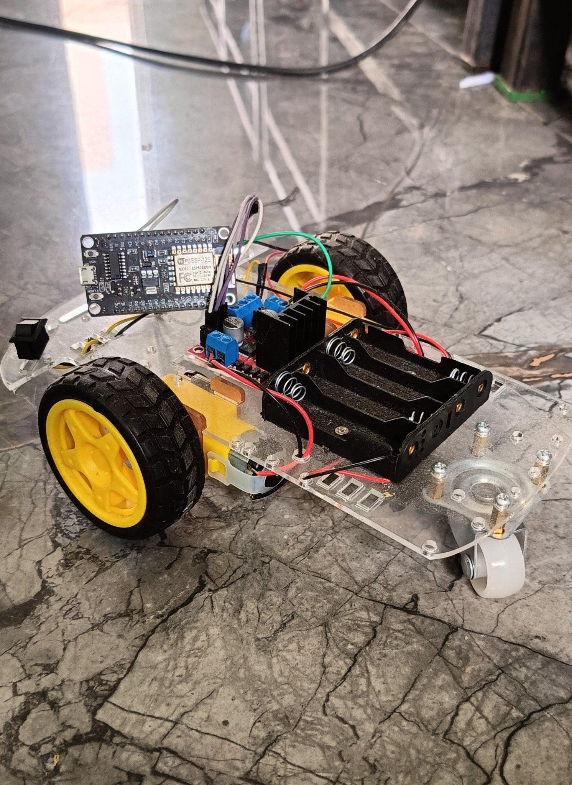
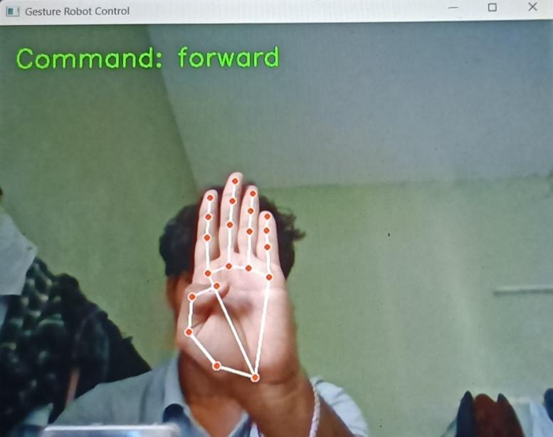
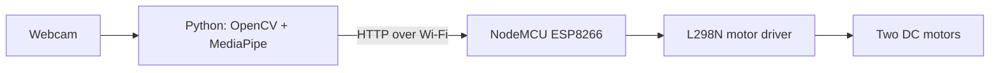

# Gesture-Controlled Robot using ESP8266 and MediaPipe

[](https://www.python.org/)
[](https://opencv.org/)
[](https://ai.google.dev/edge/mediapipe/solutions/vision/hand_landmarker)
[](https://www.espressif.com/en/products/socs/esp8266)
[](LICENSE)

A real-time hand-gesture-controlled mobile robot built with Python, OpenCV,
MediaPipe, a NodeMCU ESP8266 and an L298N motor driver. A webcam detects the
operator's hand, the Python program converts its pose into a movement command,
and the command is sent to the robot over Wi-Fi using HTTP.



## Demonstration


## Gesture controls

| Hand gesture | Robot action |
| --- | --- |
| Open hand held straight toward the camera | Move forward |
| Open hand tilted to the left | Turn left, then continue forward |
| Open hand tilted to the right | Turn right, then continue forward |
| Closed fist | Move backward |
| No hand detected | Stop |

## Actual system flow



The uploaded component overview is also available at
[media/component-overview.png](media/component-overview.png). The diagram above
shows the actual data and control direction used by the project.

## Main features

- Real-time detection of 21 hand landmarks
- Four gesture-based movement commands
- Automatic stop when the hand leaves the camera frame
- Guaranteed stop request when the controller closes or the camera fails
- Five-frame stability filter to reduce accidental command changes
- Automatic retry when an HTTP command cannot reach the robot
- Direct ESP8266 access-point connection without an internet connection
- HTTP endpoints for forward, backward, left, right and stop
- Serial Monitor output for movement and connection debugging
- Reduced camera resolution for lower processing delay

## Hardware

| Component | Purpose |
| --- | --- |
| NodeMCU ESP8266 (ESP-12E) | Creates the robot Wi-Fi network and receives commands |
| L298N motor driver | Controls the direction of both DC motors |
| Two DC geared motors | Drive the robot |
| Three-wheel robot chassis | Two powered wheels and one caster wheel |
| Battery supply | Powers the motor driver and robot electronics |
| Computer with webcam | Detects hand gestures and sends commands |

## Connections

| NodeMCU pin | ESP8266 GPIO | L298N input |
| --- | ---: | --- |
| D1 | 5 | IN1 |
| D2 | 4 | IN2 |
| D5 | 14 | IN3 |
| D6 | 12 | IN4 |

Connect the NodeMCU ground and L298N ground together. Power the motors through
the motor driver using a suitable battery; do not power the motors directly
from the NodeMCU.

## How it works

1. The NodeMCU starts a Wi-Fi access point named `RobotCar`.
2. The computer connects to that Wi-Fi network.
3. The Python program reads frames from the webcam and uses MediaPipe Hands to
   detect hand landmarks.
4. Finger count and the horizontal difference between the wrist and index
   fingertip determine the movement command.
5. A command must remain stable for five frames before it is accepted.
6. The program sends an HTTP request to the NodeMCU at `192.168.4.1`.
7. The NodeMCU drives the L298N input pins according to the requested movement.

## HTTP commands

| Endpoint | Action |
| --- | --- |
| `http://192.168.4.1/forward` | Move forward |
| `http://192.168.4.1/back` | Move backward |
| `http://192.168.4.1/left` | Turn left, then move forward |
| `http://192.168.4.1/right` | Turn right, then move forward |
| `http://192.168.4.1/stop` | Stop both motors |

## Setup and running

### 1. Upload the ESP8266 firmware

1. Open
   `firmware/gesture_controlled_robot/gesture_controlled_robot.ino` in the
   Arduino IDE.
2. Replace `YOUR_ROBOT_WIFI_PASSWORD` with a password of at least eight
   characters in your private local copy.
3. Select **NodeMCU 1.0 (ESP-12E Module)** and the correct COM port.
4. Compile and upload the sketch.
5. Open the Serial Monitor at `115200` baud and confirm that the access point
   starts at `192.168.4.1`.

Do not commit your real Wi-Fi password to a public repository.

### 2. Prepare the Python environment

Python 3.10 is recommended because the project uses the MediaPipe legacy Hands
API available through `mp.solutions.hands`.

```bash
python -m venv .venv
```

Activate the environment on Windows:

```powershell
.venv\Scripts\activate
```

Install the dependencies:

```bash
python -m pip install -r requirements.txt
```

### 3. Run the controller

1. Connect the computer to the `RobotCar` Wi-Fi network.
2. Run:

   ```bash
   python software/gesture_control.py
   ```

3. Hold one hand clearly in front of the webcam.
4. Press `Esc` to close the program safely.

## Troubleshooting

| Problem | Check |
| --- | --- |
| `Robot not reachable` | Connect the computer to `RobotCar` and confirm the IP is `192.168.4.1`. |
| Camera does not open | Close other camera applications or change `VideoCapture(0)` to the correct camera index. |
| Left and right are reversed | Confirm the mirrored camera view and motor wiring. |
| Robot direction is reversed | Check the L298N input connections and motor-terminal polarity. |
| Gestures change too slowly | Reduce `stable_count == 5` carefully after testing. |

## Project structure

```text
gesture-controlled-robot-esp8266/
├── firmware/
│   └── gesture_controlled_robot/
│       └── gesture_controlled_robot.ino
├── media/
│   ├── component-overview.png
│   ├── demo.mp4
│   ├── gesture-detection.jpg
│   └── robot-prototype.jpg
├── software/
│   └── gesture_control.py
├── .gitignore
├── GITHUB_UPLOAD_GUIDE.md
├── LICENSE
├── README.md
└── requirements.txt
```

## Future improvements

- PWM-based speed control
- Obstacle detection using ultrasonic sensors
- Battery-level monitoring
- Adjustable gesture thresholds through a user interface
- MediaPipe Tasks migration for future library compatibility

## License

This project is open source under the [MIT License](LICENSE).
